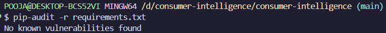
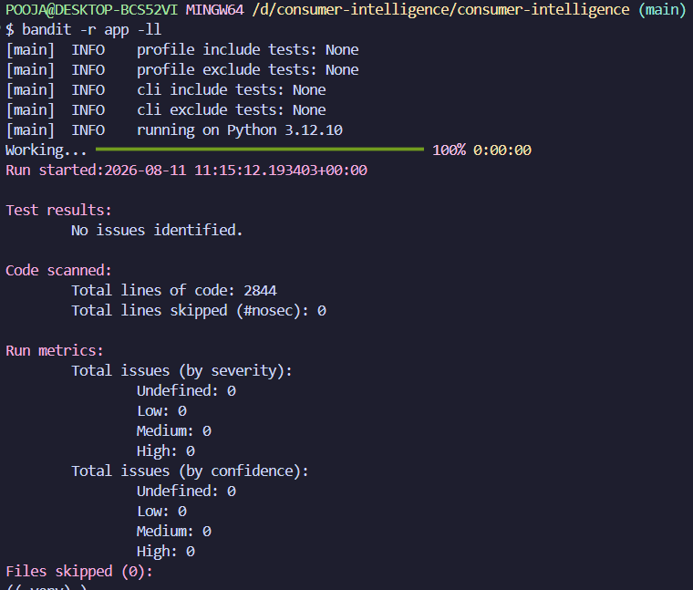
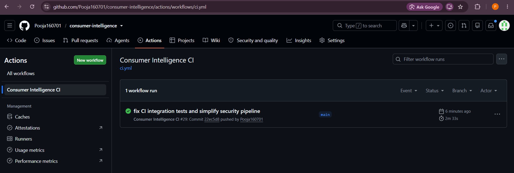
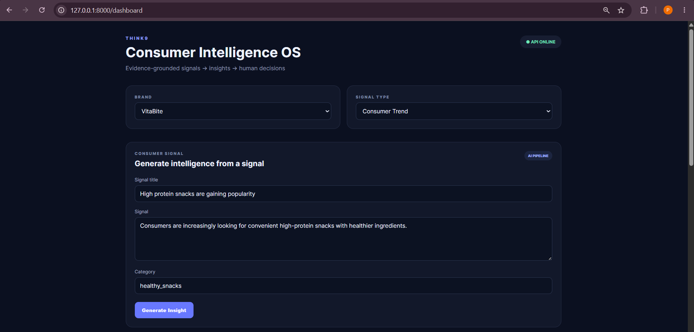
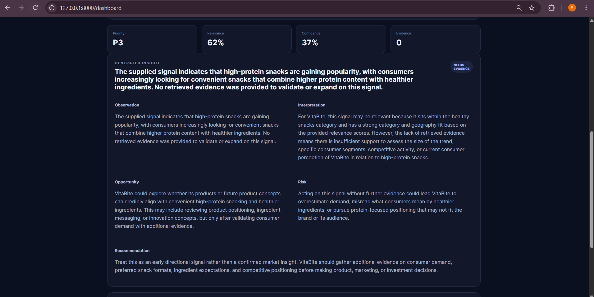
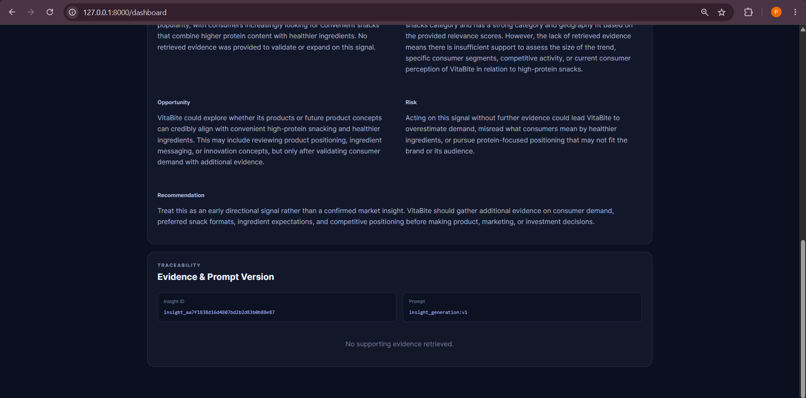
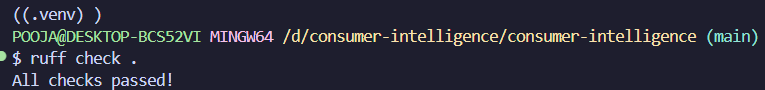

# Think9 Consumer Intelligence OS

> An agentic intelligence layer that transforms fragmented consumer and market signals into evidence-backed, brand-specific opportunities and risks.

## Why

Think9 is building 30+ consumer brands simultaneously. Consumer and market signals are distributed across sources, difficult to normalize, and easy to analyze too slowly.

The goal of this system is to move from:

**Signal → Research → Insight → Decision**

to:

**Signal → Evidence → AI Analysis → Brand Relevance → Priority → Human Decision**

The system is designed as a centralized intelligence layer that can be configured for multiple brands.

---

## What it does

- Ingests consumer and market signals
- Normalizes and deduplicates incoming data
- Stores signals and evidence in PostgreSQL
- Retrieves supporting evidence using FAISS
- Runs an agentic intelligence workflow
- Applies brand-specific context and relevance
- Produces structured, evidence-backed insights
- Scores confidence, relevance and priority
- Supports human review and approval/rejection
- Exposes the workflow through FastAPI
- Provides a Streamlit dashboard
- Evaluates outputs against a golden dataset
- Runs automated tests and security checks in CI

---

## Intelligence Workflow

```text
External Signals
      │
      ▼
Ingestion
      │
      ▼
Normalize + Deduplicate
      │
      ▼
PostgreSQL
      │
      ▼
Evidence Retrieval / FAISS
      │
      ▼
Agentic Intelligence Workflow
      │
      ├── Context
      ├── Evidence
      ├── Analysis
      ├── Brand Relevance
      └── Recommendation
      │
      ▼
Confidence + Priority
      │
      ▼
Human Review
      │
      ├── Approve
      ├── Reject
      └── Modify
      │
      ▼
Brand Intelligence
```

---

## Architecture

The system separates:

* **Ingestion** — collect and normalize signals
* **Storage** — PostgreSQL as the system of record
* **Retrieval** — FAISS-based semantic evidence retrieval
* **Intelligence** — LangGraph workflow for stateful reasoning
* **Brand context** — configurable brand/category information
* **Review** — human approval and audit history
* **API** — FastAPI service
* **UI** — Streamlit dashboard
* **Evaluation** — golden dataset + regression tests
* **Security** — dependency, code, secret and container scanning

See [`docs/architecture.md`](docs/architecture.md).

---

## Engineering Highlights

| Area                | Implementation                       |
| ------------------- | ------------------------------------ |
| API                 | FastAPI                              |
| Agent workflow      | LangGraph                            |
| LLM integration     | Provider abstraction + mock provider |
| Retrieval           | FAISS                                |
| Embeddings          | Sentence Transformers                |
| Database            | PostgreSQL                           |
| ORM                 | SQLAlchemy                           |
| Migrations          | Alembic                              |
| Dashboard           | Streamlit                            |
| Testing             | Pytest                               |
| Linting             | Ruff                                 |
| Static security     | Bandit                               |
| Dependency security | pip-audit                            |
| Secret scanning     | Gitleaks                             |
| Container scanning  | Trivy                                |
| CI/CD               | GitHub Actions                       |
| Containerization    | Docker                               |

---

## Evaluation

The repository includes a small golden dataset and automated evaluation tests covering:

* category classification
* evidence grounding
* regression behavior

Current local evaluation:

```text
3/3 golden cases passed
```

The full test suite has also been executed locally:

```text
56 passed
```

Security checks completed locally include:

```text
Bandit      → No issues identified
pip-audit   → No known vulnerabilities found
Ruff        → All checks passed
Alembic     → No new upgrade operations detected
```

These are repository validation results, not production performance claims.

---

## Human-in-the-Loop

The system deliberately does **not** make autonomous business decisions.

AI:

```text
Discover
  ↓
Analyze
  ↓
Retrieve Evidence
  ↓
Prioritize
  ↓
Recommend
```

Human:

```text
Review
  ↓
Approve / Reject / Modify
```

This keeps business ownership with the relevant decision maker while using AI to accelerate research and synthesis.

---

## Multi-Brand Design

Brand configuration is separated from the core intelligence workflow.

Conceptually:

```text
                    Think9
                      │
          ┌───────────┴───────────┐
          │ Consumer Intelligence │
          │         OS            │
          └───────────┬───────────┘
                      │
        ┌─────────────┼─────────────┐
        ▼             ▼             ▼
     Brand A       Brand B       Brand N
        │             │             │
        ▼             ▼             ▼
   Brand Context  Brand Context  Brand Context
```

The prototype demonstrates the architecture using configured brands rather than claiming production deployment across all 30+ brands.

---

## Repository Structure

```text
.
├── app/
│   ├── api/
│   ├── config/
│   ├── intelligence/
│   ├── models/
│   └── services/
├── dashboard/
├── data/
│   ├── evaluation/
│   ├── processed/
│   ├── raw/
│   └── brands.yaml
├── docs/
│   ├── architecture.md
│   ├── decisions.md
│   ├── roadmap.md
│   └── security.md
├── tests/
│   ├── unit/
│   ├── integration/
│   └── evaluation/
├── alembic/
├── .github/
│   └── workflows/
├── Dockerfile
├── docker-compose.yml
├── requirements.txt
└── README.md
```

---

## Run Locally

### 1. Clone

```bash
git clone <repository-url>
cd consumer-intelligence
```

### 2. Create environment

```bash
python -m venv .venv
```

Windows:

```bash
source .venv/Scripts/activate
```

Linux/macOS:

```bash
source .venv/bin/activate
```

### 3. Install dependencies

```bash
pip install -r requirements.txt
```

### 4. Configure environment

```bash
cp .env.example .env
```

Configure PostgreSQL and application settings as required.

### 5. Start PostgreSQL

```bash
docker compose up -d postgres
```

### 6. Run migrations

```bash
alembic upgrade head
```

### 7. Start API

```bash
uvicorn app.main:app --reload
```

### 8. Start dashboard

```bash
streamlit run dashboard/app.py
```

---

## Validation

Run:

```bash
ruff check .
pytest -q
bandit -r app -ll
pip-audit -r requirements.txt
alembic check
python -m data.evaluation.evaluate
```

---

## Documentation

* [Architecture](docs/architecture.md)
* [Architecture Decisions](docs/decisions.md)
* [30-Day Roadmap](docs/roadmap.md)
* [Security](docs/security.md)

---

## Screenshots















---

## Prototype Scope

This repository is a working prototype intended to demonstrate the architecture and engineering approach.

Production deployment would require additional work around:

* production data connectors
* authentication and authorization
* secrets management
* distributed scheduling
* observability infrastructure
* production-scale vector storage
* model/provider governance
* load testing
* deployment infrastructure

---